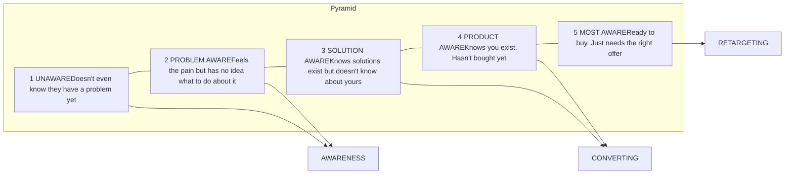
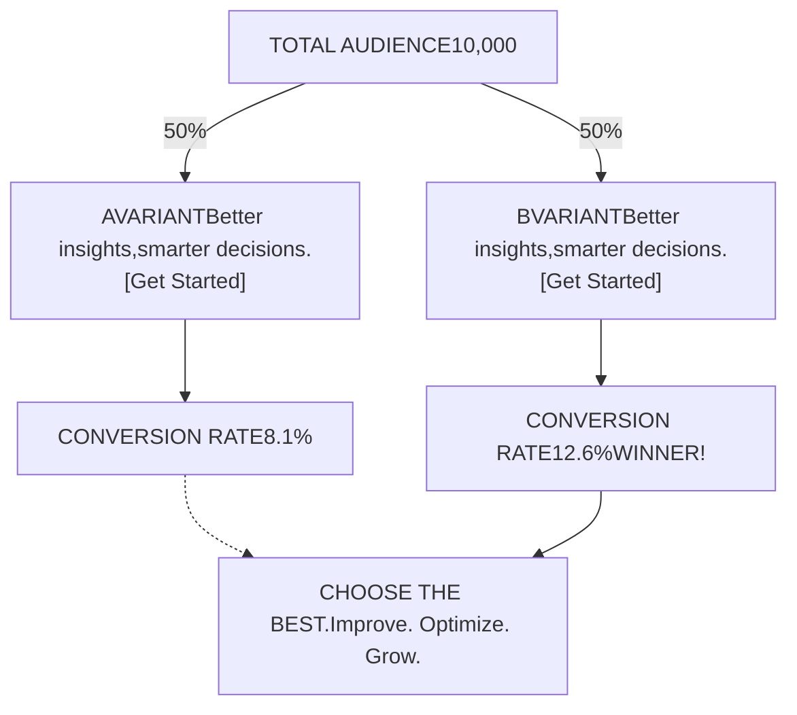

# Ad strategy: awareness levels, objectives, testing

Decide who the ad is for and what it must do before writing.

## Contents

- [Ad Strategy Guide](#ad-strategy-guide)
- [Before You Write a Single Script...](#before-you-write-a-single-script)
- [THE 5 LEVELS OF CUSTOMER AWARENESS](#the-5-levels-of-customer-awareness)
- [The 3 Ad Objectives](#the-3-ad-objectives)
- [1. AWARENESS ADS (Reaching New People)](#1-awareness-ads-reaching-new-people)
- [2. CONVERTING ADS (Turning Interest Into Action)](#2-converting-ads-turning-interest-into-action)
- [3. RETARGETING ADS (Bringing People Back)](#3-retargeting-ads-bringing-people-back)
- [Putting It All Together](#putting-it-all-together)
- [Quick Match Reference](#quick-match-reference)
- [Ad Strategy Guide 2026](#ad-strategy-guide-2026)
- [What you're building](#what-youre-building)
- [1. Move from tools into advertising strategy](#1-move-from-tools-into-advertising-strategy)
- [2. Use the course PDFs as your strategy system](#2-use-the-course-pdfs-as-your-strategy-system)
- [3. Start with customer awareness](#3-start-with-customer-awareness)
- [4. Build ads around mass desire and psychology](#4-build-ads-around-mass-desire-and-psychology)
- [5. Use frameworks instead of guessing](#5-use-frameworks-instead-of-guessing)
- [6. Use master prompts with the right context](#6-use-master-prompts-with-the-right-context)
- [7. Turn the script into a production blueprint](#7-turn-the-script-into-a-production-blueprint)
- [8. Use emotion and platform-native format](#8-use-emotion-and-platform-native-format)
- [9. Test variations instead of betting on one ad](#9-test-variations-instead-of-betting-on-one-ad)
- [The big idea](#the-big-idea)
- [Extra teaching from the lesson videos (Phase 5)](#extra-teaching-from-the-lesson-videos-phase-5)

---

## Ad Strategy Guide

Understanding Awareness Levels, Ad Objectives & When To Use What

## Before You Write a Single Script...

Let me be real with you. Most people fail with ads. Not because their product sucks, not because the platform is broken, and not because ads "don't work anymore." They fail because they run the wrong ad to the wrong person at the wrong time.

Think about it. You wouldn't walk up to a stranger on the street and ask them to buy your course. But that's exactly what most people do with their ads. They skip the intro, skip the context, and go straight for the sale. Then they wonder why nobody converts.

This guide breaks down the ONE concept that changed everything for me: customer awareness levels. It sounds fancy but it's dead simple. Where is your audience in their journey? Once you figure that out, picking the right ad type becomes obvious. You stop guessing. You stop wasting money. You start matching the right message to the right person.

I'm going to walk you through the five levels of awareness, the three types of ads you'll ever need, and exactly which frameworks from the Scriptwriting Playbook to use for each one. By the end of this guide, you'll never look at ads the same way again.

# The 5 Levels of Customer Awareness

*This is the foundation everything else is built on*

## THE 5 LEVELS OF CUSTOMER AWARENESS

Where your audience sits determines which ad you run

| Level            | Description                                         | Strategy      |
| ---------------- | --------------------------------------------------- | ------------- |
| 5 MOST AWARE     | Ready to buy. Just needs the right offer.           | ↑ RETARGETING |
| 4 PRODUCT AWARE  | Knows you exist. Hasn't bought yet.                 |               |
| 3 SOLUTION AWARE | Knows solutions exist but doesn't know about yours. | ↑ CONVERTING  |
| 2 PROBLEM AWARE  | Feels the pain but has no idea what to do about it. |               |
| 1 UNAWARE        | Doesn't even know they have a problem yet.          | ↑ AWARENESS   |

### Level 1: UNAWARE

These people don't even know they have a problem. They're scrolling TikTok at 2am not thinking about your product at all. Your job here is to interrupt their scroll and make them realize something is off.

### Level 2: PROBLEM AWARE

They feel the pain but have no clue what to do about it. They know their skin is bad, their energy is low, their business is stuck. But they haven't started looking for solutions yet. They just know something isn't right.

### Level 3: SOLUTION AWARE

They know solutions exist. They've probably Googled it, watched a few videos, maybe tried a competitor. But they don't know about YOUR specific product yet. This is where most of your audience actually sits.

### Level 4: PRODUCT AWARE

They know who you are. They've seen your ad, visited your site, maybe even added to cart. But something stopped them from buying. Price, timing, trust, whatever. They need a nudge.

Level 5: MOST AWARE

These people already know your product, probably love it, and just need the right offer at the right time. Past customers, email subscribers, engaged followers. Easiest people to convert.

## The 3 Ad Objectives

*Every ad you ever run fits into one of these three buckets*

## 1. AWARENESS ADS (Reaching New People)

**Goal: Get in front of people who have never heard of you.**

Think of this as casting a wide net. You're not trying to sell here. You're trying to stop the scroll, spark curiosity, and make someone think "wait, what was that?" These ads target Level 1 and Level 2 people.

**What works:**

* Entertainment and value first, product second

* Pattern interrupts (unexpected visuals, bold claims, curiosity hooks)

* Educational content that leads to your brand

* Story driven content that builds emotional connection

* Broad targeting, let the algorithm find your audience

**What to measure:** Views, reach, engagement rate, cost per 1000 impressions

**Frameworks from the Scriptwriting Playbook that work best here:**

THE SPARK (social proof momentum), THE MYTH KILLER (contrarian hooks), THE RAW TAKE (organic feel), THE EDUCATOR (value first), THE PRESSURE COOKER (pain agitation), THE CLIFFHANGER (curiosity loops)

## 2. CONVERTING ADS (Turning Interest Into Action)

**Goal: Take someone who already knows about you (or their problem) and get them to buy.**

This is the money maker. These ads target Level 2, 3, and 4 people. They already feel the pain or they already know your product exists. Your job is to close the deal.

**What works:**

* Clear product demonstrations

* Testimonials and social proof cascades

* Side by side comparisons

* Before and after transformations

* Strong CTAs with urgency or risk reversal (money back guarantees, free trials)

* Feature to benefit breakdowns

**What to measure:** Click through rate, cost per click, conversion rate, return on ad spend

**Frameworks that work best here:**

THE COUNTDOWN (listicle power), THE SHORTCUT (simplicity sells), THE WITNESS (testimonial cascade), THE DEMO DROP (product in action), THE TIME MACHINE (before/after), THE FACE-OFF (vs. comparisons), THE BRIDGE (goal/gap/gain)

## 3. RETARGETING ADS (Bringing People Back)

**Goal:** Re-engage people who already interacted with you but didn't buy.

These people visited your site, watched your video, added to cart, or engaged with a previous ad. They're warm. They just need one more push. This is usually where you get the cheapest conversions.

**What works:**

* Objection handling (address why they didn't buy)

* Social proof stacking (reviews, testimonials, user counts)

* Limited time offers and exclusive deals

* Behind the scenes and founder story content

* Reminder ads ("Still thinking about it?")

* UGC style "I almost didn't buy this" testimonials

**What to measure:** Return on ad spend, cost per acquisition, frequency (don't burn people out)

**Frameworks that work best here:**

THE CONVICTION (objection crushing), THE ORIGIN STORY (founder trust), THE WITNESS (social proof), THE GRIT AD (raw, authentic feel)

## Putting It All Together

*The simple system*

Here's how it works in practice. You run awareness ads to cold audiences to get them into your world. Some of those people click, watch, engage. Now they're warm. You retarget those warm people with converting ads. Some buy. Some don't. The ones who don't get retargeting ads.

It's a funnel, but don't overthink it. At its simplest:

**Step 1:** Run awareness ads to new people (use awareness frameworks)
**Step 2:** Retarget engaged viewers with conversion ads (use converting frameworks)
**Step 3:** Retarget site visitors and cart abandoners with retargeting ads (use retargeting frameworks)

The biggest mistake I see is people running conversion ads to cold audiences. You're asking someone to buy when they don't even know who you are yet. That's like proposing on the first date. Warm them up first.

## Quick Match Reference

**If your audience is... UNAWARE** → Run awareness ads
**If your audience is... PROBLEM AWARE** → Run awareness or converting ads
**If your audience is... SOLUTION AWARE** → Run converting ads
**If your audience is... PRODUCT AWARE** → Run converting or retargeting ads
**If your audience is... MOST AWARE** → Run retargeting ads

## Ad Strategy Guide 2026

<u>*Built for creators who want ads that actually convert.*</u>

---

# AI Ads, Strategy, Psychology, and Testing

## What you're building

Move from simply using AI tools to creating ads with real strategy behind them. The goal is to understand why an ad works: what makes someone stop scrolling, what makes a video feel native instead of fake, and how to use AI speed with advertising psychology, frameworks, testing, and iteration.

Strong AI ads are not just cool visuals; they are built around hooks, emotion, audience awareness, and a clear selling strategy.

## 1. Move from tools into advertising strategy

Learning the tools is only half the job. The next step is understanding why an ad actually works. AI lets you create faster than a traditional creator, agency, or production team, but speed without strategy just creates more noise.

* Use AI to create more concepts, styles, and variations.

* Use strategy to decide what those variations should actually do.

* Do not just generate random cool videos.

* Every ad needs a reason to exist: a hook, a target audience, an emotion, and a conversion goal.

The resource library gives the strategy layer that sits underneath the AI tools: frameworks, psychology, hooks, examples, and playbooks.

## 2. Use the course PDFs as your strategy system

The advertising PDFs are not just extra reading. They are references you can use when planning ads, writing prompts, and asking AI chat to generate scripts. They help turn scattered ideas into structured creative direction.

* Use the scriptwriting frameworks to choose ad structure.

* Use the strategy guide to understand audience stage and offer angle.

* Use the psychology playbook to find the emotional trigger.

* Use the hook library when the first three seconds need work.

* Use example scripts as reference for tone and pacing.

The Resources folder contains the main ad-strategy documents you can use as references when creating AI ads.

## 3. Start with customer awareness

Not every viewer is at the same stage. Some people do not know they have a problem. Some know the problem but do not know the solution. Some are comparing products. Some are almost ready to buy. Your ad should match the awareness level.

* Unaware audiences need a problem or pattern interrupt.

* Problem-aware audiences need the pain framed clearly.

* Solution-aware audiences need a better mechanism or new way.

* Product-aware audiences need proof and differentiation.

* Most-aware audiences need offer, urgency, or retargeting.

**The 5 Levels of Customer Awareness**
*This is the foundation everything else is built on*

**THE 5 LEVELS OF CUSTOMER AWARENESS**
Where your audience sits determines which ad you run

**Level 1: UNAWARE**
These people don't even know they have a problem. They're scrolling TikTok at 2am not thinking about your product at all. Your job here is to interrupt their scroll and make them realize something is off.

**Level 2: PROBLEM AWARE**
They feel the pain but have no clue what to do about it. They know their skin is bad, their energy is low, their business is stuck. But they haven't started looking for solutions yet. They just know something isn't right.

Customer-awareness levels help you decide whether the ad should educate, create desire, prove the mechanism, or push the offer.

## 4. Build ads around mass desire and psychology

Good ads connect to something the audience already wants. The psychology matters because people do not stop scrolling for features alone. They stop for desire, fear, identity, curiosity, proof, status, relief, and transformation.

* Find the desire already inside the market.

* Connect the product to that desire.

* Make the pain or opportunity feel specific.

* Use emotion without making the ad feel fake.

* Let the visual style support the psychological angle.

Advertising psychology gives the ad its emotional reason to exist, not just a product explanation.

## 5. Use frameworks instead of guessing

A framework gives the ad a structure. Instead of asking AI to write a random script, choose the framework that best fits the product, audience, proof, and visual style.

* Use proof-based frameworks when proof is the strongest asset.

* Use problem-solution frameworks when the pain needs to be felt first.

* Use founder/story frameworks when trust matters.

* Use demo frameworks when seeing the product work is most convincing.

* Use native/UGC frameworks when the ad should feel like real content.

The playbook shows how to apply frameworks so each ad has a clear structure instead of random lines.

## 6. Use master prompts with the right context

When using AI chat, do not just ask for an ad. Attach or reference the right PDFs, then give the product, audience, stage, proof, mechanism, offer, and desired format. The more useful context you give, the stronger the output becomes.

* Tell the AI what product or offer is being promoted.

* Define the target audience and awareness stage.

* Add pain points, desired outcome, proof, mechanism, and CTA.

* Tell it which format you want: UGC, podcast, claymation, VSL, talking object, etc.

* Ask it to choose a framework and explain why.

A structured prompt template gives AI chat the context it needs to write a useful ad script and creative plan.

Prompt input checklist

`Product + audience + awareness stage + pain points + desired outcome + proof + mechanism + offer + CTA + format + tone.`

## 7. Turn the script into a production blueprint

A strong output should not stop at a script. It should include a video blueprint: what the viewer sees, what is said, on-screen text, camera style, pacing, props, locations, AI-generated visuals, and where the product appears.

* Break the ad into timed sections.

* Separate voiceover/dialogue from visual direction.

* Include shot-by-shot instructions.

* Add B-roll, props, locations, and visual style notes.

* Make the output practical enough to hand to a creator, editor, or AI video tool.

a8c94d440b4

[Edit]

**HOST:**
"And they're doing fifty percent off?"

**GUEST:**
"Fifty percent off your first order right now. Tap Shop Now, try Grüns and make your daily nutrition habit considerably easier."

**Step 7: Video blueprint**

**Shot 1 — Controversial opening**
**Time:** 0–3 seconds
**Viewer sees:** Tight close-up of the nutritionist already mid-conversation, leaning towards the microphone.
**Dialogue:** "If your morning greens make you gag..."
**On-screen text:** YOUR GREENS SHOULDN'T MAKE YOU GAG
**Camera:** Slightly imperfect handheld 50mm close-up with subtle micro-movement.
**Pacing:** No intro, logo or establishing shot. Open directly on the guest.
**Native detail:** Start half a beat before the sentence, as though the clip was taken from a longer interview.

**Shot 2 — Host reaction**
**Time:** 3–7 seconds
**Viewer sees:** Host raises his eyebrows and leans closer to the microphone.
**Dialogue:** "Wait—you actually tell people to stop drinking greens?"
**On-screen text:** "STOP DRINKING GREENS?"
**Camera:** Fast cut to a side-angle close-up.
**Pacing:** Allow a brief natural pause before the guest responds.

A video blueprint turns the ad idea into a production plan with shots, voiceover, pacing, and visual direction.

## 8. Use emotion and platform-native format

Ads work when the format feels native to the platform and the emotion is clear. A TikTok ad should not feel like a polished TV commercial. A Meta ad should not look like a random AI demo. The format has to match how people consume content.

* TikTok/Reels usually need fast, native, vertical, hook-first content.

* UGC should feel like real content, not a polished brand commercial.

* Podcast ads should feel like clipped expert conversation.

* Claymation or 3D ads need a strong visual pattern interrupt.

* The platform decides how polished, fast, native, or direct the ad should feel.

Different formats create different emotional entry points: podcast authority, UGC realism, AI spectacle, and product-led proof.

## 9. Test variations instead of betting on one ad

The best advertisers do not rely on one perfect idea. They create variations and learn from the audience. AI is powerful because it lets you test more hooks, angles, formats, visuals, scripts, and offers faster than before.

* Test different hooks for the same concept.

* Test the same script in different visual styles.

* Test UGC vs podcast vs animated vs product demo formats.

* Track which version gets attention and converts.

* Use the winner to inform the next round of variations.

### A/B SPLIT TESTING

Test two versions. Learn. Choose what works best.

A/B split testing shows why variations matter: the audience decides which hook, format, or angle wins.

**Testing rule**

Do not ask: is this ad good? Ask: what are we testing, what metric proves it worked, and what do we change next?

## The big idea

AI gives you speed, but strategy gives that speed direction. The strongest ads come from combining AI creation with customer psychology, proven frameworks, platform-native formats, and testing. Create more variations than a normal production team could, but make each variation purposeful.

* Start with audience and objective.

* Use the PDFs as strategy references.

* Choose a framework before writing the script.

* Turn scripts into production blueprints.

* Test hooks, formats, visuals, and offers until the market tells you what works.

## Extra teaching from the lesson videos (Phase 5)

* **Three questions before creating anything:** Who is this ad for? What do they already know? What do I need this ad to achieve? There should be a reason behind every ad.
* **One ad = one audience, one dominant desire, one main message.** Don't communicate every benefit in one video. The same skincare product can be bought to feel more attractive or to feel confident leaving the house without makeup; same product, different emotional angle, different ad.
* **The goal of an ad is not to explain the product; it is to make the viewer feel something strong enough to keep watching.** A car ad sells freedom, status, control, power, taste or identity. A Nike ad sells discipline, ambition, resilience and the identity of someone who pushes through. A skincare ad sells confidence, softness, attractiveness or the relief of finally finding something that works.
* **Market sophistication:** in a new market, explaining what the product does can be enough. In a crowded market the audience has heard hundreds of similar promises, so you need a stronger mechanism, a more specific angle, better proof or a different presentation.
* **Start from a belief they already hold** and lead them gradually to your conclusion; don't open with a claim they won't believe.
* **Every platform has its own language:**
  - TikTok: fast, native, vertical, hook-first.
  - YouTube: more room for storytelling and explanation.
  - Instagram: more visual, aesthetic and identity-driven.
  - Meta ads: usually more direct and conversion-focused.
  Don't make one ad and expect it to work everywhere; adapt it per platform.
* **AI is a production engine, not a style.** The same product can become a cinematic ad, a fake podcast clip, an AI influencer video, a claymation or 2D animation.
* **Testing:** professionals don't assume the first idea wins. Test the same script with different hooks, the same message in different formats, the same visual with different voiceovers, the same offer with different CTAs. The goal isn't endless random content; it's variations built on a clear strategy.
* **Complete system:** audience + awareness level → main desire and emotional angle → visual style/format + framework → script → variations to test.
