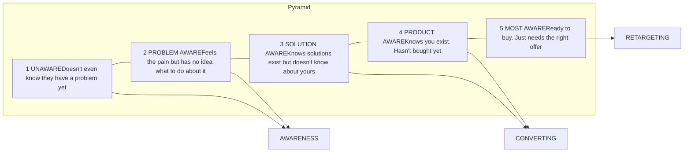
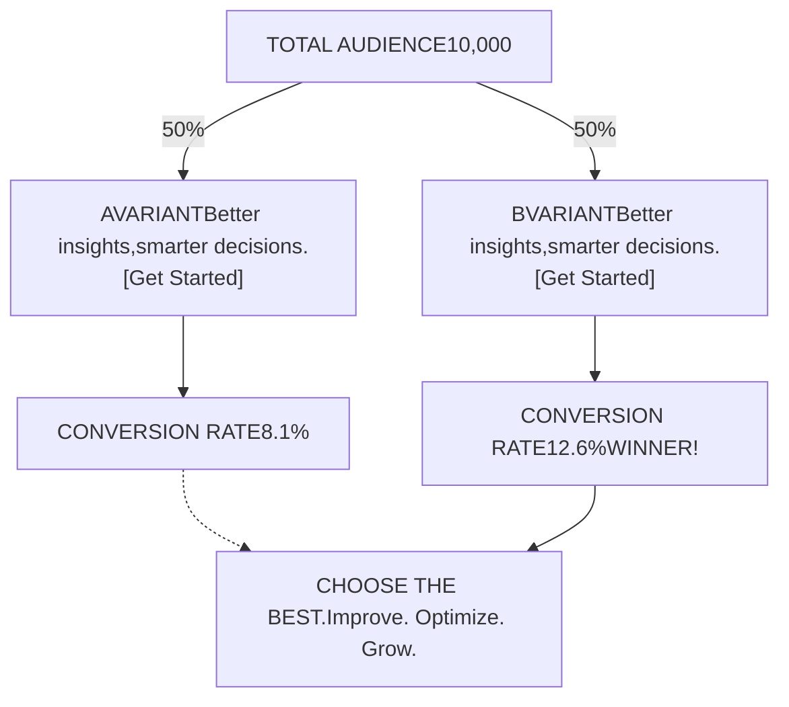

# ai ads strategy psychology testing guide

> Source: ai ads strategy psychology testing guide.pdf (original PDF in Downloads/AI_Video_Bootcamp_Phases_2-9.zip)

<!-- page 1 -->

## AI VIDEO BOOTCAMP

# AI Ads, Strategy, Psychology, and Testing

Lesson Support Guide

<!-- page 2 -->

## What you're building

Move from simply using AI tools to creating ads with real strategy behind them. The goal is to understand why an ad works: what makes someone stop scrolling, what makes a video feel native instead of fake, and how to use AI speed with advertising psychology, frameworks, testing, and iteration.

photo: three vertical panels showing a woman in a podcast setting with the word "DISGUSTING", an AI-animated office meeting, and a woman holding a product bottle

Strong AI ads are not just cool visuals; they are built around hooks, emotion, audience awareness, and a clear selling strategy.

<!-- page 3 -->

## 1. Move from tools into advertising strategy

Learning the tools is only half the job. The next step is understanding why an ad actually works. AI lets you create faster than a traditional creator, agency, or production team, but speed without strategy just creates more noise.

* Use AI to create more concepts, styles, and variations.

* Use strategy to decide what those variations should actually do.

* Do not just generate random cool videos.

* Every ad needs a reason to exist: a hook, a target audience, an emotion, and a conversion goal.

screenshot: Community Classroom interface showing AI Adverts & AI UGC resources including Advert Scripting Frameworks, Awareness Levels Ad Strategy Guide, The Ad Psychology Bible, Hook Library, and AI UGC Example Scripts

The resource library gives the strategy layer that sits underneath the AI tools: frameworks, psychology, hooks, examples, and playbooks.

<!-- page 4 -->

## 2. Use the course PDFs as your strategy system

The advertising PDFs are not just extra reading. They are references you can use when planning ads, writing prompts, and asking AI chat to generate scripts. They help turn scattered ideas into structured creative direction.

* Use the scriptwriting frameworks to choose ad structure.

* Use the strategy guide to understand audience stage and offer angle.

* Use the psychology playbook to find the emotional trigger.

* Use the hook library when the first three seconds need work.

* Use example scripts as reference for tone and pacing.

screenshot: Community Classroom interface showing the Resources folder with PDF links for Advert Scripting Frameworks, Awareness Levels Ad Strategy Guide, The Ad Psychology Bible, Hook Library, and AI UGC Example Scripts

The Resources folder contains the main ad-strategy documents you can use as references when creating AI ads.

<!-- page 5 -->

## 3. Start with customer awareness

Not every viewer is at the same stage. Some people do not know they have a problem. Some know the problem but do not know the solution. Some are comparing products. Some are almost ready to buy. Your ad should match the awareness level.

* Unaware audiences need a problem or pattern interrupt.

* Problem-aware audiences need the pain framed clearly.

* Solution-aware audiences need a better mechanism or new way.

* Product-aware audiences need proof and differentiation.

* Most-aware audiences need offer, urgency, or retargeting.

**The 5 Levels of Customer Awareness**
*This is the foundation everything else is built on*

**THE 5 LEVELS OF CUSTOMER AWARENESS**
Where your audience sits determines which ad you run

**Level 1: UNAWARE**
These people don't even know they have a problem. They're scrolling TikTok at 2am not thinking about your product at all. Your job here is to interrupt their scroll and make them realize something is off.

**Level 2: PROBLEM AWARE**
They feel the pain but have no clue what to do about it. They know their skin is bad, their energy is low, their business is stuck. But they haven't started looking for solutions yet. They just know something isn't right.

Customer-awareness levels help you decide whether the ad should educate, create desire, prove the mechanism, or push the offer.

<!-- page 6 -->

## 4. Build ads around mass desire and psychology

Good ads connect to something the audience already wants. The psychology matters because people do not stop scrolling for features alone. They stop for desire, fear, identity, curiosity, proof, status, relief, and transformation.

* Find the desire already inside the market.

* Connect the product to that desire.

* Make the pain or opportunity feel specific.

* Use emotion without making the ad feel fake.

* Let the visual style support the psychological angle.

screenshot: computer screen showing a document titled "PRINCIPLE 1: MASS DESIRE" within the AI Video Bootcamp platform

Advertising psychology gives the ad its emotional reason to exist, not just a product explanation.

<!-- page 7 -->

## 5. Use frameworks instead of guessing

A framework gives the ad a structure. Instead of asking AI to write a random script, choose the framework that best fits the product, audience, proof, and visual style.

* Use proof-based frameworks when proof is the strongest asset.

* Use problem-solution frameworks when the pain needs to be felt first.

* Use founder/story frameworks when trust matters.

* Use demo frameworks when seeing the product work is most convincing.

* Use native/UGC frameworks when the ad should feel like real content.

screenshot: AI Video Bootcamp playbook guide

The playbook shows how to apply frameworks so each ad has a clear structure instead of random lines.

<!-- page 8 -->

## 6. Use master prompts with the right context

When using AI chat, do not just ask for an ad. Attach or reference the right PDFs, then give the product, audience, stage, proof, mechanism, offer, and desired format. The more useful context you give, the stronger the output becomes.

* Tell the AI what product or offer is being promoted.

* Define the target audience and awareness stage.

* Add pain points, desired outcome, proof, mechanism, and CTA.

* Tell it which format you want: UGC, podcast, claymation, VSL, talking object, etc.

* Ask it to choose a framework and explain why.

screenshot: AI chat interface showing a prompt for an AI Podcast with product details for Gruns gummy bears

A structured prompt template gives AI chat the context it needs to write a useful ad script and creative plan.

Prompt input checklist

`Product + audience + awareness stage + pain points + desired outcome + proof + mechanism + offer + CTA + format + tone.`

<!-- page 9 -->

## 7. Turn the script into a production blueprint

A strong output should not stop at a script. It should include a video blueprint: what the viewer sees, what is said, on-screen text, camera style, pacing, props, locations, AI-generated visuals, and where the product appears.

* Break the ad into timed sections.

* Separate voiceover/dialogue from visual direction.

* Include shot-by-shot instructions.

* Add B-roll, props, locations, and visual style notes.

* Make the output practical enough to hand to a creator, editor, or AI video tool.

a8c94d440b4

[Edit]

**HOST:**
"And they're doing fifty percent off?"

**GUEST:**
"Fifty percent off your first order right now. Tap Shop Now, try Grüns and make your daily nutrition habit considerably easier."

**Step 7: Video blueprint**

**Shot 1 — Controversial opening**
**Time:** 0–3 seconds
**Viewer sees:** Tight close-up of the nutritionist already mid-conversation, leaning towards the microphone.
**Dialogue:** "If your morning greens make you gag..."
**On-screen text:** YOUR GREENS SHOULDN'T MAKE YOU GAG
**Camera:** Slightly imperfect handheld 50mm close-up with subtle micro-movement.
**Pacing:** No intro, logo or establishing shot. Open directly on the guest.
**Native detail:** Start half a beat before the sentence, as though the clip was taken from a longer interview.

**Shot 2 — Host reaction**
**Time:** 3–7 seconds
**Viewer sees:** Host raises his eyebrows and leans closer to the microphone.
**Dialogue:** "Wait—you actually tell people to stop drinking greens?"
**On-screen text:** "STOP DRINKING GREENS?"
**Camera:** Fast cut to a side-angle close-up.
**Pacing:** Allow a brief natural pause before the guest responds.

A video blueprint turns the ad idea into a production plan with shots, voiceover, pacing, and visual direction.

<!-- page 10 -->

## 8. Use emotion and platform-native format

Ads work when the format feels native to the platform and the emotion is clear. A TikTok ad should not feel like a polished TV commercial. A Meta ad should not look like a random AI demo. The format has to match how people consume content.

* TikTok/Reels usually need fast, native, vertical, hook-first content.

* UGC should feel like real content, not a polished brand commercial.

* Podcast ads should feel like clipped expert conversation.

* Claymation or 3D ads need a strong visual pattern interrupt.

* The platform decides how polished, fast, native, or direct the ad should feel.

photo: three vertical panels showing a podcast setup with the word "DISGUSTING", a 3D animated office scene, and a woman holding a product for a UGC-style video

Different formats create different emotional entry points: podcast authority, UGC realism, AI spectacle, and product-led proof.

<!-- page 11 -->

## 9. Test variations instead of betting on one ad

The best advertisers do not rely on one perfect idea. They create variations and learn from the audience. AI is powerful because it lets you test more hooks, angles, formats, visuals, scripts, and offers faster than before.

* Test different hooks for the same concept.

* Test the same script in different visual styles.

* Test UGC vs podcast vs animated vs product demo formats.

* Track which version gets attention and converts.

* Use the winner to inform the next round of variations.

### A/B SPLIT TESTING

Test two versions. Learn. Choose what works best.

A/B split testing shows why variations matter: the audience decides which hook, format, or angle wins.

**Testing rule**

Do not ask: is this ad good? Ask: what are we testing, what metric proves it worked, and what do we change next?

<!-- page 12 -->

## The big idea

AI gives you speed, but strategy gives that speed direction. The strongest ads come from combining AI creation with customer psychology, proven frameworks, platform-native formats, and testing. Create more variations than a normal production team could, but make each variation purposeful.

* Start with audience and objective.

* Use the PDFs as strategy references.

* Choose a framework before writing the script.

* Turn scripts into production blueprints.

* Test hooks, formats, visuals, and offers until the market tells you what works.
